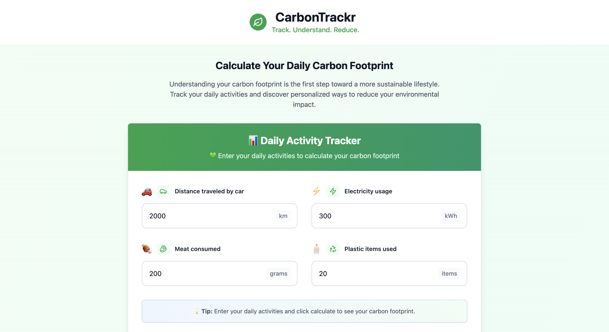
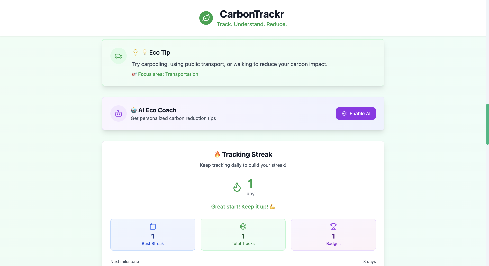

# 🌱 CarbonTrackr

> **Track. Understand. Reduce.**  
Your intelligent daily carbon footprint tracker built for the real world.

🔗 **Live Demo:** [https://carbontrackr.netlify.app](https://carbontrackr.netlify.app)  
📂 **Repository:** [github.com/yugankfatehpuria4/CarbonTrackr](https://github.com/yugankfatehpuria4/CarbonTrackr)

---

## 🎯 Overview

**CarbonTrackr** is a clean, modern web application that empowers users to **track their daily carbon footprint**, visualize which habits contribute the most, and get **personalized eco-friendly tips** to reduce their impact — all in under 2 minutes a day.

---

## 🌟 Key Features

- 🧾 **Daily Habit Input**: Car travel, electricity use, meat consumption, and plastic usage
- 📊 **Instant CO₂ Calculation**: Real-time footprint total (kg/day)
- 📈 **Pie Chart Visualization**: Breakdown of emissions by category
- 🎯 **Smart Eco Tips**: Personalized advice based on your highest emission category
- 📚 **Fun Environmental Facts**: Learn something green every day
- 📱 **Mobile Responsive**: Clean UI across desktop and mobile

---

## 🛠️ Tech Stack

| Tech           | Description                         |
|----------------|-------------------------------------|
| React + Vite   | Fast frontend and build tooling     |
| TypeScript     | Strong typing and better DX         |
| Tailwind CSS   | Utility-first responsive styling    |
| Chart.js       | Emission pie chart visualization    |
| Lucide React   | Open-source icon library            |
| Netlify        | Deployment and hosting              |

---

## 📸 Screenshots

> Make sure to add these images to an `assets` or `public` folder in your repo

| Dashboard Input | Emissions Breakdown | Eco Tips |
|-----------------|---------------------|----------|
|  |   |  |

---

## 🚀 Setup & Installation

### 🔧 Prerequisites

- [Node.js](https://nodejs.org/) (v18+ recommended)
- npm or yarn


### ⚙️ Local Installation

```bash
git clone https://github.com/yugankfatehpuria4/CarbonTrackr.git
cd CarbonTrackr
npm install
npm run dev
```
---
### 💡 Usage Guide
1). Input your daily data:
  -  🚗 Distance driven (km)
  -  ⚡ Electricity used (kWh)
  -  🍖 Meat consumed (grams)
  -  🧴 Plastic items used

2). View your carbon footprint total and pie chart breakdown

3). Read personalized suggestions and environmental facts

4). Reset or update values anytime

---

### 📁 Folder Structure
```bash
CarbonTrackr/
├── public/              # Static assets
├── src/
│   ├── components/      # Form, ResultsDisplay, PieChart, Suggestions, Footer
│   ├── types/           # TypeScript definitions
│   ├── utils/           # CO₂ calculation logic
│   ├── App.tsx          # Main app component
│   └── main.tsx         # App entry point
├── tailwind.config.js   # Tailwind setup
├── vite.config.ts       # Vite build config
├── netlify.toml         # Netlify SPA config
└── README.md
```

---

## 🗺️ Future Roadmap
 - ✅ Weekly streak tracker
 - ✅ GPT-powered smart recommendations
 - 📨 Weekly email summaries
 - ☁️ Cloud data storage with MongoDB + Clerk
 - 📲 PWA for offline tracking

---

### 🤝 Author

~ Built with 💚 by Yugank Fatehpuria
- Icons by Lucide
- Deployed via Netlify


